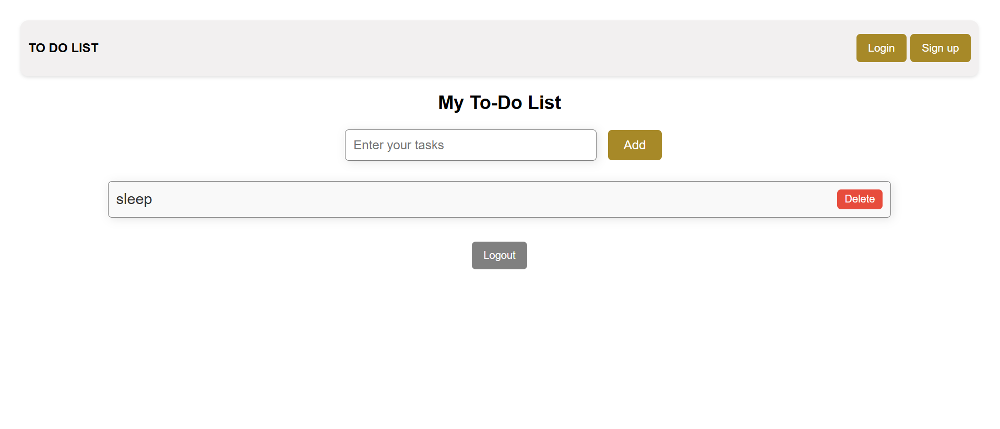

# 📝 To-Do List Website with Login & Signup

A simple **To-Do List web app** built using **HTML, CSS, and JavaScript**.  
This project includes a **Login** and **Signup** system (demo only, no database).  
Users must log in before they can access the To-Do List.

---

## ✨ Features
- 🔑 **Login & Signup Forms** (basic demo auth, no backend)
- 📝 **Add tasks** to your to-do list
- ❌ **Delete tasks** with a confirmation alert
- 👤 **Login required** before accessing the to-do list
- 🚪 **Logout option** to return to the login page
- 🎨 Responsive and clean UI using CSS

---

## 📂 Project Structure
project-folder/

│── index.html # Main HTML file.

│── style.css # Styling (CSS).

│── app.js # Functionality (JavaScript).

│── README.md # Project documentation.

---

## ⚡ How It Works
1. When you open the app, you’ll see **Login** and **Signup** buttons in the navbar.  
2. If you don’t have an account, click **Sign up**, fill details, and then go back to **Login**.  
3. After successful login, the **To-Do List** section will appear.  
4. Add tasks ➕ and delete them ❌ whenever needed.  
5. Click **Logout** 🚪 to go back to the login page.

---

## 🛠️ Technologies Used
- **HTML5** – Structure  
- **CSS3** – Styling and responsive design  
- **JavaScript (Vanilla JS)** – Interactivity & logic  

---

## 📸 Demo Preview
 

---

## 🚀 Future Improvements
- Save tasks in **localStorage** so they persist after refresh  
- Add **real authentication** with a backend (Node.js/Express + Database)  
- Add task **edit** option  
- Add task **completed / not completed** toggle  

---

## 🤝 Contributing
Pull requests are welcome. For major changes, please open an issue first to discuss.  

---

## 📜 License
This project is free to use under the **MIT License**.
